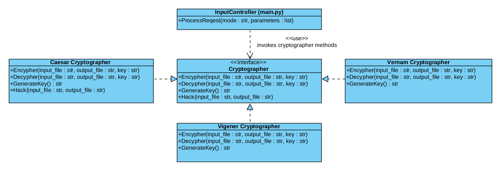

# FCrypto

FCrypto is a file encrypter that will help you to secure important information by encrypting.

Here are some features of this project:

- Encryption (and decryption) utf-8 files with a few cyphers:
  - Caesar cipher
  - Vigener cipher
  - Vernam cipher
- Cracking of Caesar cipher by frequency analysis method

## Usage

_**Requirements:**_

- installed `python3`

_**General instructions:**_

- Download FCrypto using `git` or `.zip` to some folder
- Move to this folder and open terminal here
- Run command (in this folder):
  `python3 fcrypto.py <mode-flags> <cipher-flags> [input_file_path] [output_file_path] [key]`

_**Flags:**_

- Mode flags:
  - `-e` - encypher - FCrypto reads input file and write encyphered info to specified output file
    this flag requires `cipher-flag`, `input_file_path` and `output_file_path` with `key`
  - `-d` - decypher - similarly to previous point, but decyphers file
    this flag requires `cipher-flag`, `input_file_path` and `output_file_path` with `key`
  - `-g` - generate key - display random generated key for this cipher
    this flag requires only `cipher-flag`
  - `-h` - hack - hacks cipher if it's possible and put result to output file
    this flag requires `cipher-flag`, `input_file_path` and `output_file_path`
- Cipher flags:
  - `--ca` - Caesar cipher, key format should be one integer (`10` for example)
  - `--vi` - Vigener cipher, key format is a string of upper english letters (`HELLOWORLD` for example)
  - `--ve` - Vernam cipher, key format is a string of upper english letters (`HELLOWORLD` for example)

## Architecture of project

Input controller is located in fcrypto.py. It invokes implementations of cryptographer interface (Caesar, Vigener or Vernam cryptographer). Cryptographer classes contains all logic of encryption and decryption and performs requests by themselves.

Here are UML diagram representing project structure:

